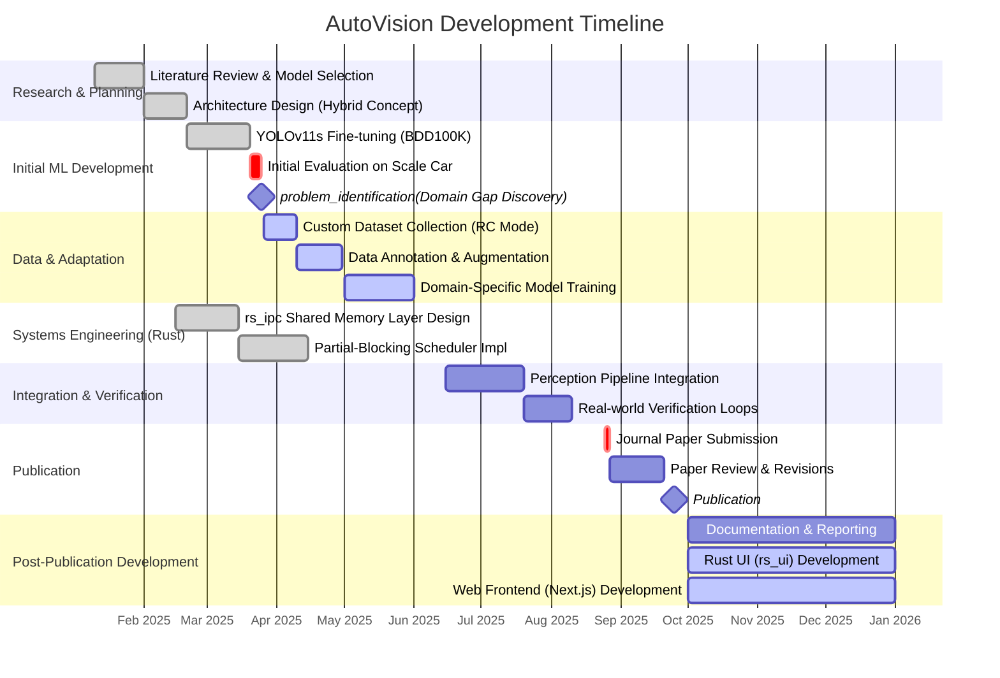

# AutoVision

AutoVision is a real-time autonomous driving perception stack. It leverages a **Hybrid Python–Rust Architecture** to solve the "Python Latency Bottleneck" by offloading inter-process communication (IPC) and synchronization to a high-performance **Rust** shared-memory layer.

This architecture allows researchers to develop deep learning models in **Python** (using PyTorch & YOLO) while ensuring deterministic, low-latency data flow suitable for real-time control.

## Key Features

*   **Hybrid Architecture:** Python for ML, Rust for Systems.
*   **Shared-Memory IPC:** `rs_ipc` crate handles zero-copy data transfer.
*   **Partial-Blocking Scheduling:** Ensures the latest frame is always processed without stalling fast detection branches.
*   **Fine-Tuned Perception:** 
    *   **YOLOv11s** optimized for Traffic Signs, Lights, and Pedestrians.
    *   **Geometric Lane Detection** for robust path finding.
*   **Domain-Specific Dataset:** Trained on custom data from the actual reduced-scale vehicle environment.

## Prerequisites

*   **Python:** 3.12+
*   **Rust:** Latest stable toolchain (install via [rustup.rs](https://rustup.rs/))
*   **Conda:** (Recommended for environment management)

## Installation

### 1. Clone the Repository
```bash
git clone <repository_url>
cd AutoVision
```

### 2. Set up Python Environment
We recommend using Conda to manage dependencies.
```bash
# Create environment (using python 3.12)
conda create -n vision python=3.12
conda activate vision

# Install core python dependencies
pip install ultralytics opencv-python numpy torch torchvision
pip install maturin  # Required for building the Rust-Python bridge
```

### 3. Build & Install `rs_ipc` (Rust-Python Bridge) inside the conda environment
This project uses `maturin` to build the Rust IPC layer as a Python package.
```bash
# Navigate to the Rust IPC package
cd rs_ipc

# Build and install into the current python environment
maturin develop --release
# OR
maturin build --release
pip install target/wheels/rs_ipc-*.whl

cd ..
```

### 4. Build `rs_ui` (Visualization)
The visualization UI is written in Rust for performance.
```bash
cd rs_ui
cargo build --release
cd ..
```

## Usage

### Running the Perception Stack
To start the perception pipeline (camera capture + ML inference):
```bash
python main.py
```

### Running the Visualization
To view the output (ensure the perception stack is running or writing to shared memory):
```bash
./rs_ui/target/release/rs_ui
```

## Project Structure

*   `main.py`: Entry point for the Python perception manager.
*   `rs_ipc/`: Rust crate implementing the Shared Memory IPC and Python bindings.
*   `rs_ui/`: Rust-based visualization tool.
*   `perception/`: Python modules for YOLO models and lane detection logic.
*   `reporting/`: Project documentation and reports.
*   `files/`: Configuration and resource files.

## Troubleshooting

*   **Windows Users:** Ensure you have "Desktop development with C++" installed via Visual Studio Installer, as it's required for compiling Rust code.
*   **Shared Memory Permissions:** On Linux/Docker, you may need to adjust `shm` limits or permissions. 

## Contributors
*   **David Szilagyi** (david.szilagyi2@stud.ubbcluj.ro)
    *   **Role:** Lead Machine Learning Engineer & Python Specialist
    *   **Responsibilities:** Developed the core YOLOv11s perception pipeline, including fine-tuning and domain adaptation. Implemented the custom geometric lane detection algorithm and managed the Python-side integration with the shared memory architecture.
    *   **Skills:** Python, PyTorch, Ultralytics YOLO, OpenCV, Computer Vision, Data Engineering.
*   **Razvan Filea** (razvan.filea@stud.ubbcluj.ro)
    *   **Role:** Systems Architect & Rust Engineer
    *   **Responsibilities:** Designed and implemented the high-performance `rs_ipc` shared-memory communication layer and the Partial-Blocking scheduling algorithm. Also developed the native Rust visualization UI (`rs_ui`) using the Iced framework.
    *   **Skills:** Rust, Systems Programming, IPC (Shared Memory), Concurrency, Iced (GUI), FFI (PyO3).
*   **Armin Torok** (armin.torok@stud.ubbcluj.ro)
    *   **Role:** Frontend Developer & Web Interface Engineer
    *   **Responsibilities:** Built the modern web-based monitoring interface using Next.js and React. This frontend provides a flexible and accessible way to visualize pipeline status and metadata remotely.
    *   **Skills:** TypeScript, Next.js, React, TailwindCSS, Web Development, UX/UI Design.

## Development Timeline

